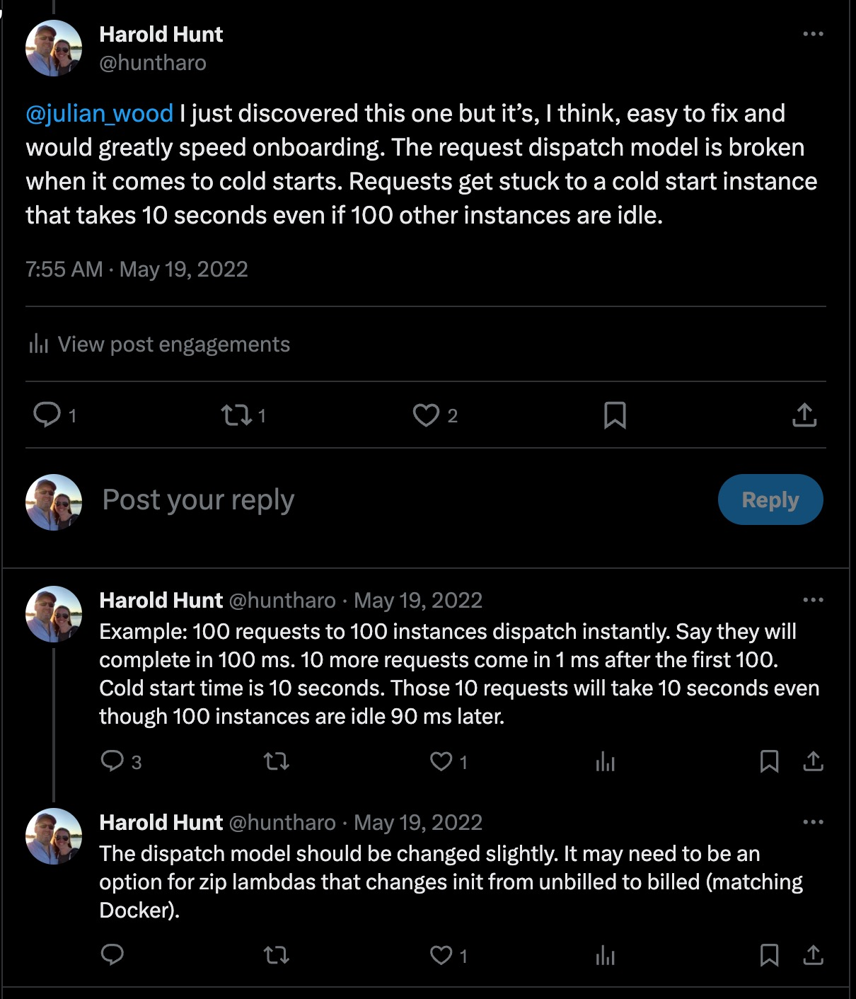
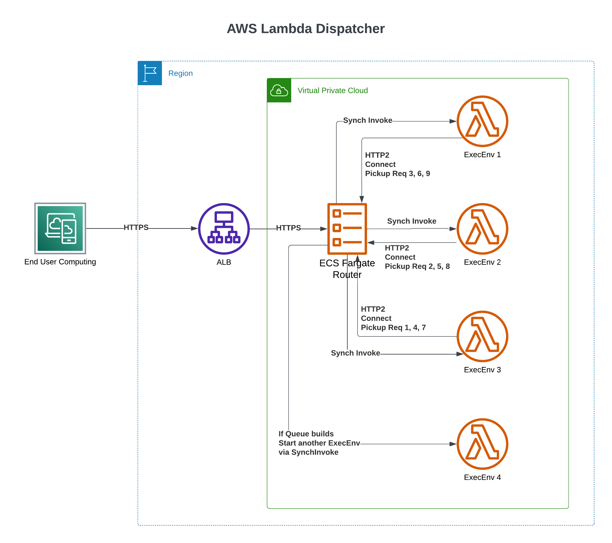
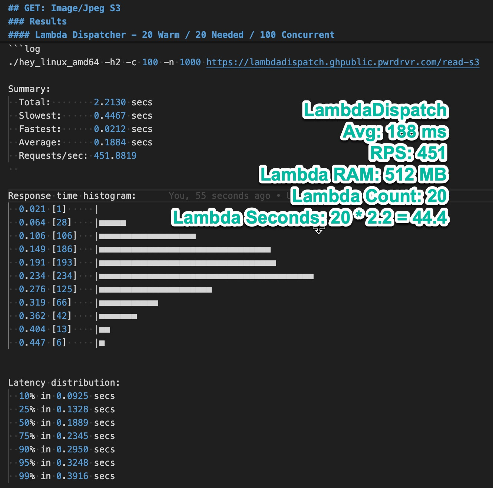
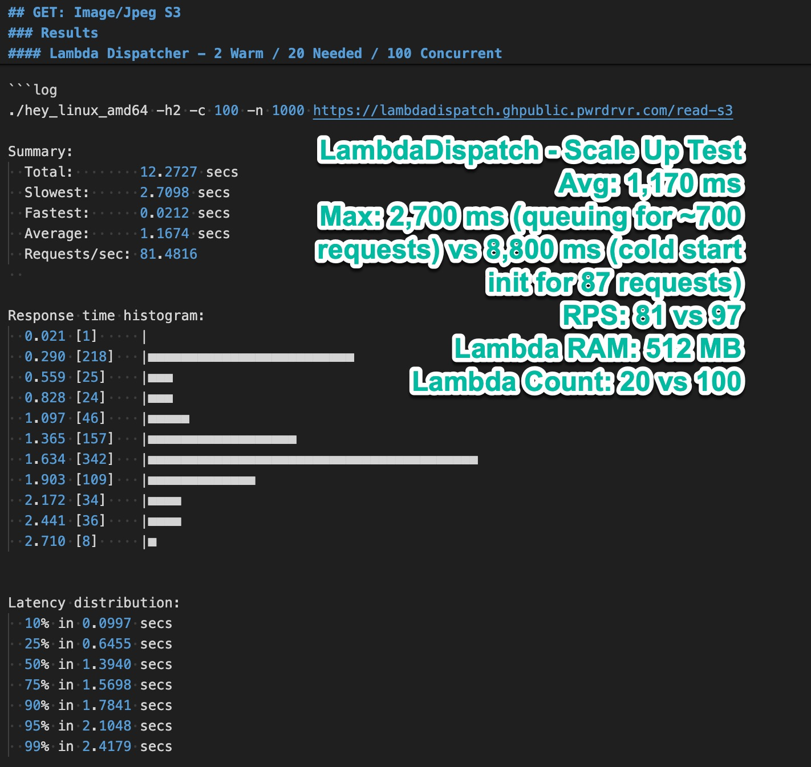
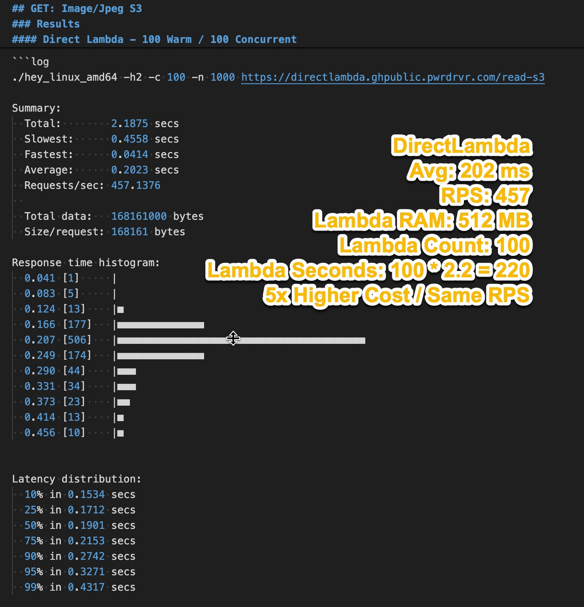
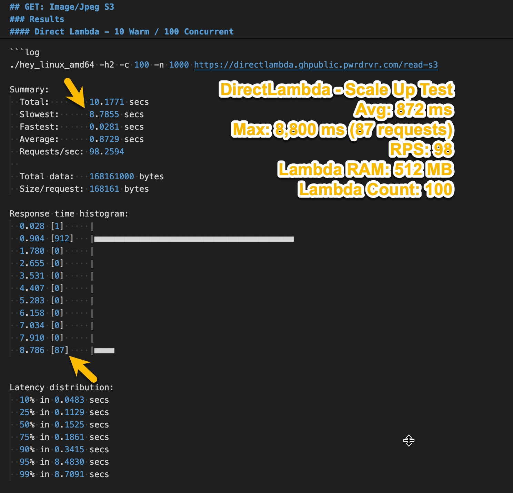

# Overview

This performs reverse routing with Lambda functions, where the Lambda functions continue running and call back to the router to pickup requests. This allows explicit control and determination of the number of available execution environments for the Lambda functions, allowing for a more predictable and consistent performance profile by mostly avoiding requests waiting for cold starts.

Additionally, when there are more parallel requests than expected execution environments, a queue is formed while additional execution environments are spun up.  Requests are dispatched from the front of the queue to the next available execution environment. This differs substantially from Lambda's built-in dispatch which will allocate a request to a new execution environment, wait for the cold start (even if several seconds) and then dispatch the request on that new execution environment even if there are already idle execution environments available.

> Reduce your Lambd costs by up to 80% and avoid cold starts completely!

## Origination

It all started with a tweet: https://x.com/huntharo/status/1527256565941673984?s=20

The desire was to enable easily migrating an existing Next.js web application with a nominal response time of 100 ms and a cold start time of 8 seconds to Lambda. The problem is that the cold start time is 80x the response time, so any burst of traffic will potentially cause a large number of requests to wait for the cold start time. This is a common problem with Lambda and is the reason that many web applications cannot be migrated to Lambda.

Moving this application from EKS with multiple concurrent requests per pod to Lambda with 1 request per exec env would require paying to wait for all remote service calls while the CPU was idle and unable to perform page rendering tasks.

The response size limitations would also require careful evaluation to ensure that no response size was ever large enough to require a work around.

AWS has been offering near-solutions to this problem such as `Snap Start` and pre-emptive scale up.  But `Snap Start` still only exists for Java and pre-emptive exec env scale up is not sufficient to address this issue.

Application-specific solutions such as webpack bundling the server-side code can help reduce the cold start time down to 2-4 seconds, but the effort required to apply these solutions is immense and presents runtime risks due to changes in how environment variables are evaluated at build time instead of runtime, etc.

## Advantages

- Avoids cold start wait durations in most cases where at least 1 exec env is running
  - Caveat: if the nubmer of queued requests (Q), divided by the total concurrent request capacity available (C), multiplied by the avg response time (t) is greater than the cold start time (T), then some requests will have to wait for the same duration as a cold start, `Q/C*t >= T`, example: Q = 100 queued requests, C = 10 request concurrent capacity, t = 1 second avg response time, T = 10 second cold start time, 100/10*1 = 10, 10 seconds of waiting for some requests
  - Completely eliminates the blocking issue preventing many web apps from using Lambda, which is that an increase in total concurrent requests will cause a large portion of requests to wait for an entire cold start duration when other exec envs are available shortly after the request is received
- Avoids `base64` encoding and decoding of requests and responses in both the Lambda function itself (where it costs CPU time) and in the API Gateway/ALB/Function URL (where it costs response time)
- Allows sending first / streaming bytes of responses all the way to the client without waiting for entire response to be buffered
  - For large responses this better utilizes the available bandwidth to the client and reduces the time to first byte
- Eliminates the request / response body size limitations of API Gateway/ALB/Function URLs
- Allows each exec env to handle multiple requests concurrently
  - Eliminates "paying to wait" for I/O bound requests
  - Allows increasing the CPU available to each exec env
- Reduces costs up to 80% with similar throughput rates and response times
  - Caveat: varies based on numerous factors
- Continues the benefits of serverless for all application logic while, hopefully temporarily, adding a small amount of infrastructure to manage the routing
- Demonstrates to AWS that there it is possible to build a better Lambda dispatch mechanism

## Disadvantages

- Requires an ECS Fargate cluster to run the router
  - There is a cost to operating this component, but it should be minimal compared to the Lambdas
- Requires a VPC for the Lambdas to connect to the router

## Project Status

Consider this a `0.9` release as of 2024-01-01.  This has been tested with billions of requests using `hey` but has not yet been tested with a production load.

This can be tested for production loads and can be carefully monitored in a production environment with a portion of traffic.

The `router` does not necessarily handle graceful shutdown of itself yet, but it does gracefully shutdown the Lambdas and not drop requests going to them.

Feedback is welcome and encouraged. Please open an issue for any questions, comments, or concerns.

## AWS Bills / Cost Risks

- Your AWS bill is your own!
- This project is not responsible for any AWS charges you incur
- Contributors to this project are not responsible for any AWS charges you incur
- Institute monitoring and alerting on Lambda costs and ECS Fargate costs to detect any potential runaway invokes immediatetly (as of 2024-01-01 there there are a few limited cases where this could happen but it has only been observed once in testing and development)

## Request Distribution

## Project Implementation

The project was built with DotNet 8 and C# and generates a single binary, similar to Go/Rust, that can be used within a Lambda to connect to the AWS Lambda Runtime API to receive invocations.  The structure is similar to the [AWS Lambda Web Adapter](https://github.com/awslabs/aws-lambda-web-adapter) in that the adapter starts the contained application via a `bootstrap.sh` shell script then connects to that application on port 3000, and checks a `/health` route (which can perform cold start logic).  The adapter then connects to the Router over HTTP2 to pickup requests.

DotNet on Linux does suffer from a problem that is causing higher-than-necessary CPU usage due to the way spin locks are being used by the thread pool to poll for new work. [High CPU Problem on DotNet on Linux](https://github.com/dotnet/runtime/issues/72153#issuecomment-1216363757) There is a workaround (setting the `DOTNET_ThreadPool_UnfairSemaphoreSpinLimit` env var to 0-6), but the CPU usage is still 2-3x higher than it should be. If this is not resolved in DotNet and if the project needs to exist for a long time, then the project may need to be rewritten in Go or Rust.

## Installation / Setup

As of 2024-01-01, [fargate.template.yaml](fargate.template.yaml) contains an example deploy, [DockerfileLambda](DockerfileLambda) shows how to package the runtime with a Node.js lambda, and [DockerfileRouter](DockerfileRouter) packages up the router.

## Development

See [DEVELOPMENT.md](DEVELOPMENT.md) for details on how to build and run the project locally.

## Performance

See [PERFORMANCE.md](PERFORMANCE.md) for details on performance testing.

|                | Steady State                                                        | Scale Up                                                         |
| -------------- | ------------------------------------------------------------------- | ---------------------------------------------------------------- |
| LambdaDispatch |  |  |
| DirectLambda   |      |      |

## Similar / Related Projects

- [AWS Lambda Web Adapter](https://github.com/awslabs/aws-lambda-web-adapter)
- [serverless-adapter](https://github.com/H4ad/serverless-adapter)
- [serverless-express](https://github.com/CodeGenieApp/serverless-express)
