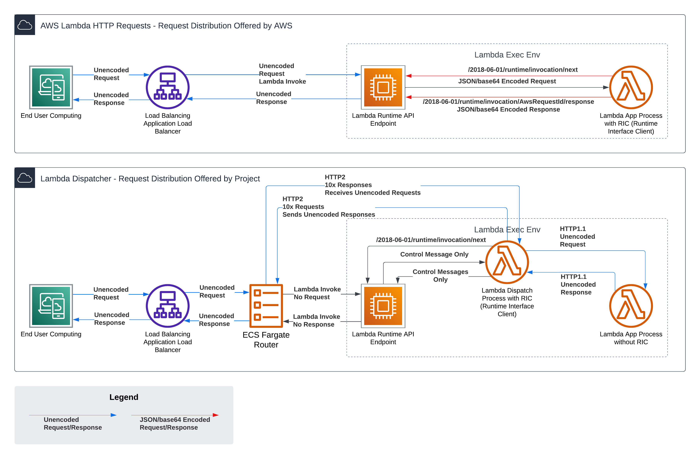

# Overview

This performs reverse routing with Lambda functions, where the Lambda functions continue running and call back to the router to pickup requests. This allows explicit control and determination of the number of available execution environments for the Lambda functions, allowing for a more predictable and consistent performance profile by mostly avoiding requests waiting for cold starts.

Additionally, when there are more parallel requests than expected execution environments, a queue is formed while additional execution environments are spun up.  Requests are dispatched from the front of the queue to the next available execution environment. This differs substantially from Lambda's built-in dispatch which will allocate a request to a new execution environment, wait for the cold start (even if several seconds) and then dispatch the request on that new execution environment even if there are already idle execution environments available.

> Reduce your AWS Lambda costs by up to 80% and avoid cold starts completely!

## Problem Being Solved - Cold Starts for Web Requests

Web applications can have lengthy cold start times and users waiting for those cold start times can increase the bounce and frustration rates, making it more difficult to choose AWS Lambda for hosting web applications.

The YouTube video below demonstrates the problem in detail (since many think the problem does not exist!).

[](https://www.youtube.com/watch?v=2dW1mSFCbdM)

## CDK Implementation

The project includes a CDK construct library that makes it easy to deploy Lambda Dispatch in your AWS account. The constructs handle all the necessary infrastructure including VPC configuration, security groups, IAM roles, and ECS services.

### Installation

```bash
npm install @pwrdrvr/lambda-dispatch-construct
```

### Usage

```typescript
import * as cdk from 'aws-cdk-lib';
import * as ec2 from 'aws-cdk-lib/aws-ec2';
import * as ecs from 'aws-cdk-lib/aws-ecs';
import { LambdaConstruct, EcsConstruct } from '@pwrdrvr/lambda-dispatch-construct';

export class MyStack extends cdk.Stack {
  constructor(scope: Construct, id: string, props?: cdk.StackProps) {
    super(scope, id, props);

    // Create or import your VPC
    const vpc = new ec2.Vpc(this, 'MyVpc', {
      maxAzs: 2
    });

    // Create the Lambda function
    const lambdaConstruct = new LambdaConstruct(this, 'MyLambda', {
      vpc,
      memorySize: 512,  // Optional, defaults to 192
      timeout: cdk.Duration.seconds(30)  // Optional, defaults to 60
    });

    // Create ALB and HTTPS listener (example)
    const alb = new elbv2.ApplicationLoadBalancer(this, 'MyAlb', {
      vpc,
      internetFacing: true
    });
    const httpsListener = alb.addListener('HttpsListener', {
      port: 443,
      certificates: [certificate],
      // ... other listener configuration
    });

    // Create the ECS service that runs the router
    const ecsConstruct = new EcsConstruct(this, 'MyEcs', {
      vpc,
      lambdaFunction: lambdaConstruct.function,
      loadBalancer: alb,
      httpsListener,
      // Optional configurations
      memoryLimitMiB: 2048,  // Default: 2048
      cpu: 1024,  // Default: 1024
      maxCapacity: 10,  // Default: 10
      minCapacity: 1,  // Default: 1
      // Cost optimization options
      useFargateSpot: true,  // Default: false
      cpuArchitecture: ecs.CpuArchitecture.AMD64  // Required for Fargate Spot
    });
  }
}
```

### Construct Properties

#### LambdaConstructProps
- `vpc`: VPC where the Lambda function will be deployed
- `ecsSecurityGroup?`: Optional security group for ECS tasks that will invoke this Lambda
- `memorySize?`: Memory size for the Lambda function in MB (default: 192)
- `timeout?`: Timeout for the Lambda function (default: 60 seconds)

#### EcsConstructProps
- `vpc`: VPC where the ECS service will be deployed
- `lambdaFunction`: Lambda function that will be invoked by the ECS service
- `loadBalancer`: Application Load Balancer for the ECS service
- `httpsListener`: HTTPS listener for the Application Load Balancer
- `memoryLimitMiB?`: Memory limit for the ECS task in MiB (default: 2048)
- `cpu?`: CPU units for the ECS task (default: 1024)
- `maxCapacity?`: Maximum number of ECS tasks (default: 10)
- `minCapacity?`: Minimum number of ECS tasks (default: 1)
- `useFargateSpot?`: Whether to use Fargate Spot for cost savings (default: false)
- `cpuArchitecture?`: CPU architecture for ECS tasks (default: ARM64)

### Cost Optimization

The construct supports two main strategies for cost optimization:

1. **Fargate Spot**
   - Enable with `useFargateSpot: true`
   - Can reduce costs by up to 70% compared to regular Fargate
   - Only supports AMD64 architecture
   - Best for non-production or fault-tolerant workloads

2. **ARM64 Architecture**
   - Default when not using Fargate Spot
   - About 20% cheaper than AMD64
   - Not compatible with Fargate Spot

Choose your configuration based on your needs:
- For maximum cost savings: Use Fargate Spot with AMD64
- For reliable ARM benefits: Use regular Fargate with ARM64
- For development: Either option works well

Note: When `useFargateSpot` is true, the construct automatically sets `cpuArchitecture` to AMD64 as required by Fargate Spot.

### Best Practices

1. **VPC Configuration**: Deploy both Lambda and ECS in a VPC with private subnets for enhanced security. Use NAT gateways or instances for outbound internet access.

2. **Security Groups**: The constructs automatically create and configure security groups with least-privilege access between components.

3. **Auto Scaling**: The ECS service includes CPU-based auto-scaling by default, scaling between min and max capacity based on a 50% CPU target.

4. **Cost Optimization**: 
   - Use Fargate Spot for non-critical or development environments
   - Use ARM64 for production environments where consistent pricing is important
   - Consider your application's fault tolerance when choosing between Spot and regular Fargate

5. **Health Checks**: The ECS service includes proper health checks configured on the target group.

## Advantages

- Avoids cold start wait durations in most cases where at least 1 exec env is running
  - Caveat: if the number of queued requests (Q), divided by the total concurrent request capacity available (C), multiplied by the avg response time (t) is greater than the cold start time (T), then some requests will have to wait for the same duration as a cold start, `Q/C*t >= T`, example: Q = 100 queued requests, C = 10 request concurrent capacity, t = 1 second avg response time, T = 10 second cold start time, 100/10*1 = 10, 10 seconds of waiting for some requests
  - Completely eliminates the blocking issue preventing many web apps from using Lambda, which is that an increase in total concurrent requests will cause a large portion of requests to wait for an entire cold start duration when other exec envs are available shortly after the request is received
- Avoids `base64` encoding and decoding of requests and responses in both the Lambda function itself (where it costs CPU time) and in the API Gateway/ALB/Function URL (where it costs response time)
- Allows sending first / streaming bytes of responses all the way to the client without waiting for entire response to be buffered
  - For large responses this better utilizes the available bandwidth to the client and reduces the time to first byte
- Eliminates the request / response body size limitations of API Gateway/ALB/Function URLs
- Allows each exec env to handle multiple requests concurrently
  - Eliminates "paying to wait" for I/O bound requests
  - Allows increasing the CPU available to each exec env
- Reduces costs up to 80% with similar throughput rates and response times
  - Caveat: varies based on numerous factors
- Continues the benefits of serverless for all application logic while, hopefully temporarily, adding a small amount of infrastructure to manage the routing
- Demonstrates to AWS that there it is possible to build a better Lambda dispatch mechanism

## Disadvantages

- Requires an ECS Fargate cluster to run the router
  - There is a cost to operating this component, but it should be minimal compared to the Lambdas
- Requires a VPC for the Lambdas to connect to the router

## Project Status

Consider this a `0.9` release as of 2024-01-01.  This has been tested with billions of requests using `hey` but has not yet been tested with a production load.

This can be tested for production loads and can be carefully monitored in a production environment with a portion of traffic.

The `router` does not necessarily handle graceful shutdown of itself yet, but it does gracefully shutdown the Lambdas and not drop requests going to them.

Feedback is welcome and encouraged. Please open an issue for any questions, comments, or concerns.

## AWS Bills / Cost Risks

- Your AWS bill is your own!
- This project is not responsible for any AWS charges you incur
- Contributors to this project are not responsible for any AWS charges you incur
- Institute monitoring and alerting on Lambda costs and ECS Fargate costs to detect any potential runaway invokes immediatetly (as of 2024-01-01 there there are a few limited cases where this could happen but it has only been observed once in testing and development)

## Request Distribution

### Comparison with Lambda's Built-In Dispatch



### Lambda Dispatch - Detail


## Project Implementation

The project was initially built in DotNet 8 with C# for both the Router and the Lambda Extension, but the Lambda Extension was later rewritten in Rust using Hyper and the Tokio async runtime to resolve a high CPU usage issue.  However, the high CPU usage issue was not resolved directly by the Rust rewrite; instead both the router and extension needed to be restricted to use only 1 worker thread to avoid the high CPU usage; the problem of too much CPU usage was common to the DotNet Router, DotNet Extension, and the Rust Extension.

The structure of the extension is similar to the [AWS Lambda Web Adapter](https://github.com/awslabs/aws-lambda-web-adapter) in that the extension connects to that application on port 3000, and waits for aa `/health` route (which can perform cold start logic) to return a 200 before connecting back to the Router over HTTP2 to pickup requests.

## Installation / Setup

As of 2024-02-04, [fargate.template.yaml](fargate.template.yaml) contains an example deploy, [DockerfileLambdaDemoApp](DockerfileLambdaDemoApp) shows how to package the runtime with a Node.js lambda, and [DockerfileRouter](DockerfileRouter) packages up the router.

### Docker Images

The docker images are published to the AWS ECR Public Gallery:

- [Lambda Dispatch Router](https://gallery.ecr.aws/pwrdrvr/lambda-dispatch-router)
  - Latest: `public.ecr.aws/pwrdrvr/lambda-dispatch-router:main`
  - Available for both ARM64 and AMD64
- [Lambda Dispatch Extension](https://gallery.ecr.aws/pwrdrvr/lambda-dispatch-extension)
  - Latest: `public.ecr.aws/pwrdrvr/lambda-dispatch-extension:main`
  - Available for both ARM64 and AMD64
- [Lambda Dispatch Demo App](https://gallery.ecr.aws/pwrdrvr/lambda-dispatch-demo-app)
  - Latest: `public.ecr.aws/pwrdrvr/lambda-dispatch-demo-app:main`
  - Available for both ARM64 and AMD64

### Configuration - Router

The router is configured with environment variables.

| Name                                              | Description                                                                                                                                                                                                                                                                                                                                                                                                                                                                                                                                       | Default                 |
| ------------------------------------------------- | ------------------------------------------------------------------------------------------------------------------------------------------------------------------------------------------------------------------------------------------------------------------------------------------------------------------------------------------------------------------------------------------------------------------------------------------------------------------------------------------------------------------------------------------------- | ----------------------- |
| `LAMBDA_DISPATCH_MaxWorkerThreads`                | The maximum number of worker threads to use for processing requests.  For best efficiency, set this to `1` and scale up router instances at ~50-70% CPU usage of 1 core.                                                                                                                                                                                                                                                                                                                                                                          | default DotNet handling |
| `LAMBDA_DISPATCH_ChannelCount`                    | The number of channels that the Lambda extension should create back to the router                                                                                                                                                                                                                                                                                                                                                                                                                                                                 | 20                      |
| `LAMBDA_DISPATCH_MaxConcurrentCount`              | The maximum number of concurrent requests that the Lambda extension should allow to be processed                                                                                                                                                                                                                                                                                                                                                                                                                                                  | 10                      |
| `LAMBDA_DISPATCH_AllowInsecureControlChannel`     | Opens a non-TLS HTTP2 port                                                                                                                                                                                                                                                                                                                                                                                                                                                                                                                        | false                   |
| `LAMBDA_DISPATCH_PreferredControlChannelScheme`   | The scheme to use for the control channel<br>- `http` - Use HTTP<br>- `https` - Use HTTPS                                                                                                                                                                                                                                                                                                                                                                                                                                                         | `https`                 |
| `LAMBDA_DISPATCH_IncomingRequestHTTPPort`         | The port to listen for incoming requests.  This is the port contacted by the ALB.                                                                                                                                                                                                                                                                                                                                                                                                                                                                 | 5001                    |
| `LAMBDA_DISPATCH_IncomingRequestHTTPSPort`        | The port to listen for incoming requests.  This is the port contacted by the ALB.                                                                                                                                                                                                                                                                                                                                                                                                                                                                 | 5002                    |
| `LAMBDA_DISPATCH_ControlChannelInsecureHTTP2Port` | The non-TLS port to listen for incoming control channel requests.  This is the port contacted by the Lambda extension.                                                                                                                                                                                                                                                                                                                                                                                                                            | 5003                    |
| `LAMBDA_DISPATCH_ControlChannelHTTP2Port`         | The TLS port to listen for incoming control channel requests.  This is the port contacted by the Lambda extension.                                                                                                                                                                                                                                                                                                                                                                                                                                | 5004                    |
| `LAMBDA_DISPATCH_InstanceCountMultiplier`         | Divides the MaxConcurrentCount to setup a TargetConcurrentCount, leaving additional connections to more quickly pickup the next request or to handle bursts of traffic. (e.g. set to 2, with MaxConcurrentCount set to 10, each instance would have 5 concurrent requests in the steady state).                                                                                                                                                                                                                                                   | 2                       |
| `LAMBDA_DISPATCH_EnvVarForCallbackIp`             | The name of the environment variable that will contain the IP that the Lambda extension will use to callback to the current instance of the router.  Each Lambda must be able to connect back to the router instance that invoked it.  ECS and EC2 addresses are discovered via the Metadata Service and do not require changing this setting.  EKS or other Kubernetes pod IPs can be found with the Kubernetes Downward API to inject the pod IP into an environment variable: https://kubernetes.io/docs/concepts/workloads/pods/downward-api/ | `K8S_POD_IP`            |
| `LAMBDA_DISPATCH_ScalingAlgorithm`                | The algorithm to use for scaling the number of instances of the router<br>- `simple` - Scale number of pending + running requests divided by target requests per instance `(MaxConcurrentRequests / InstanceCountMultiplier)`<br>- `ewma` - EXPERIMENTAL: Scale based on average response time and RPS (requests per second)                                                                                                                                                                                                                      | `simple`                |
| `LAMBDA_DISPATCH_CloudWatchMetricsEnabled`        | Enables sending metrics to CloudWatch                                                                                                                                                                                                                                                                                                                                                                                                                                                                                                             | `false`                 |

### Configuration - Lambda Extension

The extension is configured with environment variables.

| Name                               | Description                                                                                                                                                                                                                                                                                                                                                                                                                                                           | Default          |
| ---------------------------------- | --------------------------------------------------------------------------------------------------------------------------------------------------------------------------------------------------------------------------------------------------------------------------------------------------------------------------------------------------------------------------------------------------------------------------------------------------------------------- | ---------------- |
| LAMBDA_DISPATCH_RUNTIME            | The runtime to use for the Lambda dispatch<br>- `current_thread` - Configures Tokio to use only the current thread for async tasks<br>- `multi_thread` - Configures Tokio to start the multi thread runtime, with a default of 2 threads unless the thread count is specified by `TOKIO_WORKER_THREADS`<br>- `default_multi_thread` - Configures Tokio to start the multi thread runtime with the default behavior of creating as many threads as there are CPU cores | `current_thread` |
| LAMBDA_DISPATCH_ENABLE_COMPRESSION | Enables gzip compression of response bodies when the `content-type` is suitable, the `accept-encoding` includes `gzip`, and the `transfer-encoding` is chunked or the `content-length` is greater than 1 KB.                                                                                                                                                                                                                                                          | `true`           |
| LAMBDA_DISPATCH_PORT               | This is the port that the contained app is listening on for connections from the extension.  The application should listen on `127.0.0.1:{port}`, rather than `0.0.0.0:{port}`.  Port `3000` should be avoided as Lambda Insights listens on that port and will cause failures if Lambda Insights is enabled for a Lambda                                                                                                                                             | 3001             |
| LAMBDA_DISPATCH_ASYNC_INIT         | If set to `true`, the extension will proceed to connect to the Runtime API to pickup requests even if the healthcheck route has not returned healthy before 10 seconds is up during the init phase of the Lamda.  This prevents the exec env from being torn down and the entire init process from starting over at 0, saving approximately 10 seconds.  This can be useful for large applications such as entire sites using Next.js.                                | `false`          |

## Development

See [DEVELOPMENT.md](DEVELOPMENT.md) for details on how to build and run the project locally.

## Performance

See [PERFORMANCE.md](PERFORMANCE.md) for details on performance testing.

|                | Steady State                                                        | Scale Up                                                         |
| -------------- | ------------------------------------------------------------------- | ---------------------------------------------------------------- |
| LambdaDispatch |  |  |
| DirectLambda   |      |      |

## Origination

It all started with a tweet: https://x.com/huntharo/status/1527256565941673984?s=20


The desire was to enable easily migrating an existing Next.js web application with a nominal response time of 100 ms and a cold start time of 8 seconds to Lambda. The problem is that the cold start time is 80x the response time, so any burst of traffic will potentially cause a large number of requests to wait for the cold start time. This is a common problem with Lambda and is the reason that many web applications cannot be migrated to Lambda.

Moving this application from EKS with multiple concurrent requests per pod to Lambda with 1 request per exec env would require paying to wait for all remote service calls while the CPU was idle and unable to perform page rendering tasks.

The response size limitations would also require careful evaluation to ensure that no response size was ever large enough to require a work around.

AWS has been offering near-solutions to this problem such as `Snap Start` and pre-emptive scale up.  But `Snap Start` still only exists for Java and pre-emptive exec env scale up is not sufficient to address this issue.

Application-specific solutions such as webpack bundling the server-side code can help reduce the cold start time down to 2-4 seconds, but the effort required to apply these solutions is immense and presents runtime risks due to changes in how environment variables are evaluated at build time instead of runtime, etc.

## Similar / Related Projects

- [AWS Lambda Web Adapter](https://github.com/awslabs/aws-lambda-web-adapter)
- [serverless-adapter](https://github.com/H4ad/serverless-adapter)
- [serverless-express](https://github.com/CodeGenieApp/serverless-express)
